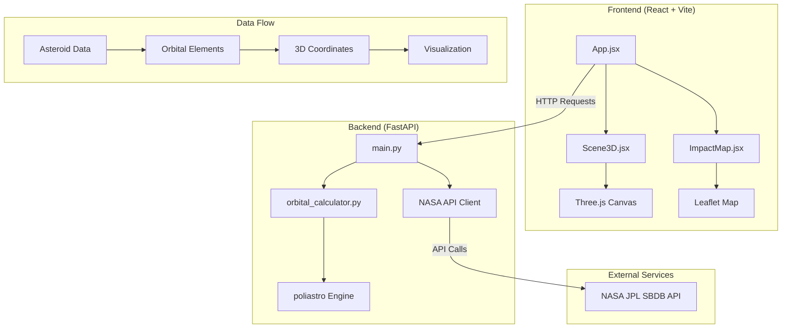

# Design Document

## Overview

Project Aegis is architected as a full-stack web application with a clear separation between backend data processing and frontend visualization. The system follows a client-server architecture where the Python FastAPI backend handles NASA API integration, orbital mechanics calculations, and impact simulations, while the React frontend manages 3D visualization and user interactions.

The application flow consists of two main user journeys:
1. **Orbital Visualization**: Automatic loading → NASA data fetch → orbital calculation → 3D rendering
2. **Impact Simulation**: User trigger → impact calculation → 2D map rendering → results display

## Architecture

### System Architecture



### Technology Stack Integration

**Backend Stack:**
- **FastAPI**: RESTful API server with automatic OpenAPI documentation
- **poliastro**: High-precision orbital mechanics calculations using Keplerian elements
- **requests**: HTTP client for NASA API integration
- **uvicorn**: ASGI server for production deployment
- **python-dotenv**: Environment variable management for API keys

**Frontend Stack:**
- **React 18**: Component-based UI with hooks for state management
- **Vite**: Fast development server and build tool
- **@react-three/fiber**: Declarative Three.js integration for React
- **@react-three/drei**: Pre-built 3D components and utilities
- **Three.js**: WebGL-based 3D graphics rendering
- **Leaflet + react-leaflet**: Interactive 2D mapping
- **axios**: Promise-based HTTP client

## Components and Interfaces

### Backend Components

#### 1. FastAPI Application (main.py)
**Responsibilities:**
- CORS middleware configuration for frontend communication
- Environment variable loading for NASA API key
- Route definitions and request/response handling
- Error handling and HTTP status management

**Key Endpoints:**
```python
GET /api/asteroid/{asteroid_name}
- Returns: Raw NASA API JSON response
- Purpose: Direct NASA data access for debugging/verification

GET /api/trajectory/{asteroid_name}  
- Returns: {"asteroid_path": [[x,y,z]...], "earth_path": [[x,y,z]...]}
- Purpose: Processed 3D coordinate arrays for visualization

POST /api/impact/calculate
- Input: {"diameter_km": float, "velocity_kps": float}
- Returns: {"craterDiameterMeters": float, "impactEnergyJoules": float}
- Purpose: Impact consequence calculations
```

#### 2. Orbital Calculator (orbital_calculator.py)
**Responsibilities:**
- NASA API response parsing for orbital elements extraction
- poliastro integration for orbit object creation
- Trajectory propagation over 2-year timespan
- Coordinate system conversion for Three.js compatibility

**Key Functions:**
```python
def extract_orbital_elements(nasa_response) -> dict
def calculate_trajectory(orbital_elements) -> list[list[float]]
def get_earth_trajectory(timespan) -> list[list[float]]
```

#### 3. NASA API Client
**Responsibilities:**
- HTTP request management to JPL SBDB API
- Parameter formatting (sstr, orb=1, phys-par=1)
- Response validation and error handling
- Rate limiting compliance

### Frontend Components

#### 1. App Component (App.jsx)
**Responsibilities:**
- Application state management (view mode, trajectory data, impact results)
- API communication with backend services
- View routing between 3D and 2D modes
- Loading state management

**State Structure:**
```javascript
{
  view: '3D' | '2D',
  trajectory: {asteroid_path: [], earth_path: []} | null,
  impactData: {craterDiameterMeters: number, impactEnergyJoules: number} | null,
  loading: boolean,
  error: string | null
}
```

#### 2. Scene3D Component (Scene3D.jsx)
**Responsibilities:**
- Three.js canvas setup and configuration
- 3D object rendering (Sun, Earth, orbital paths)
- Camera controls and lighting setup
- Trajectory line geometry creation

**3D Scene Elements:**
- **Sun**: Yellow sphere at origin (0,0,0)
- **Earth**: Blue sphere positioned on orbital path
- **Orbital Lines**: BufferGeometry-based line rendering
- **Lighting**: Ambient + point light setup
- **Controls**: OrbitControls for user interaction

#### 3. ImpactMap Component (ImpactMap.jsx)
**Responsibilities:**
- Leaflet map initialization and configuration
- Impact location visualization with circle overlay
- Map centering and zoom level management
- Impact data display in information panel

**Map Configuration:**
- **Tile Layer**: OpenStreetMap tiles
- **Impact Circle**: Radius calculated from crater diameter
- **Center Point**: Predefined impact coordinates
- **Zoom Level**: Appropriate for crater visualization

## Data Models

### Orbital Elements Model
```python
@dataclass
class OrbitalElements:
    semi_major_axis: float  # a (AU)
    eccentricity: float     # e (dimensionless)
    inclination: float      # i (degrees)
    longitude_ascending_node: float  # Ω (degrees)
    argument_periapsis: float        # ω (degrees)
    mean_anomaly: float     # M (degrees)
    epoch: float           # Julian date
```

### Trajectory Data Model
```typescript
interface TrajectoryData {
  asteroid_path: [number, number, number][];
  earth_path: [number, number, number][];
}
```

### Impact Calculation Model
```python
@dataclass
class ImpactParameters:
    diameter_km: float
    velocity_kps: float
    density_kg_m3: float = 3000.0

@dataclass
class ImpactResults:
    crater_diameter_meters: float
    impact_energy_joules: float
    mass_kg: float
```

## Error Handling

### Backend Error Handling
1. **NASA API Failures**: HTTP timeout, invalid responses, rate limiting
   - Implement exponential backoff retry logic
   - Return structured error responses with appropriate HTTP status codes
   - Log errors for monitoring and debugging

2. **Orbital Calculation Errors**: Invalid orbital elements, poliastro exceptions
   - Validate orbital elements before processing
   - Handle edge cases (hyperbolic orbits, invalid epochs)
   - Provide fallback calculations or default trajectories

3. **Impact Calculation Errors**: Invalid input parameters, mathematical edge cases
   - Input validation for diameter and velocity ranges
   - Handle division by zero and overflow conditions
   - Return error responses for invalid calculations

### Frontend Error Handling
1. **API Communication Errors**: Network failures, timeout, server errors
   - Display user-friendly error messages
   - Implement retry mechanisms for transient failures
   - Maintain application state during error recovery

2. **3D Rendering Errors**: WebGL context loss, geometry creation failures
   - Graceful degradation for unsupported browsers
   - Error boundaries to prevent application crashes
   - Loading states during intensive calculations

3. **Map Rendering Errors**: Tile loading failures, invalid coordinates
   - Fallback tile providers
   - Default map center for invalid coordinates
   - Error indicators for failed map operations

## Testing Strategy

### Backend Testing
1. **Unit Tests**:
   - Orbital calculation functions with known test cases
   - NASA API response parsing with mock data
   - Impact calculation formulas with verified results
   - Error handling scenarios

2. **Integration Tests**:
   - End-to-end API endpoint testing
   - NASA API integration with real data
   - poliastro integration with various orbital elements

3. **Performance Tests**:
   - Trajectory calculation performance with large datasets
   - Memory usage during orbital propagation
   - API response times under load

### Frontend Testing
1. **Component Tests**:
   - React component rendering with various props
   - User interaction handling (button clicks, view changes)
   - State management and updates

2. **3D Visualization Tests**:
   - Three.js scene rendering verification
   - Geometry creation with coordinate arrays
   - Camera controls and user interactions

3. **Integration Tests**:
   - API communication and data flow
   - View transitions and state persistence
   - Error handling and recovery

### End-to-End Testing
1. **User Journey Tests**:
   - Complete orbital visualization workflow
   - Impact simulation from start to finish
   - Cross-browser compatibility

2. **Performance Tests**:
   - Application loading times
   - 3D rendering performance
   - Memory usage during extended use

## Security Considerations

1. **API Key Management**:
   - NASA API key stored in environment variables
   - No client-side exposure of sensitive credentials
   - Proper .env file exclusion from version control

2. **Input Validation**:
   - Backend validation of all user inputs
   - Sanitization of asteroid names and parameters
   - Rate limiting on API endpoints

3. **CORS Configuration**:
   - Restrictive CORS policy for production
   - Development-only permissive settings
   - Proper origin validation

## Performance Optimization

1. **Backend Optimization**:
   - Caching of NASA API responses
   - Efficient orbital calculation algorithms
   - Connection pooling for database operations

2. **Frontend Optimization**:
   - Lazy loading of 3D components
   - Memoization of expensive calculations
   - Efficient Three.js geometry updates
   - Map tile caching strategies

3. **Data Transfer Optimization**:
   - Compressed trajectory data transmission
   - Minimal API response payloads
   - Efficient coordinate array serialization